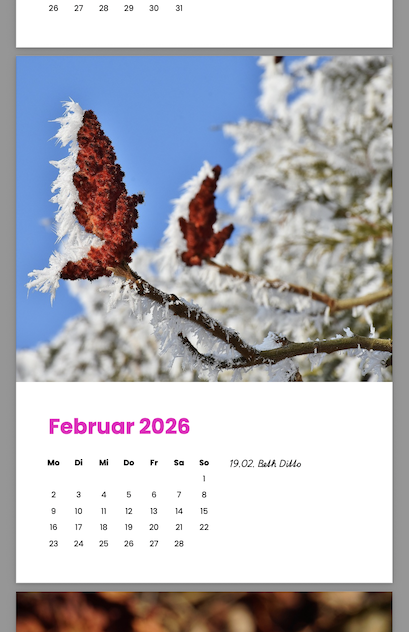

# 12 Page Month Calendar

This is an example typst template that creates a PDF with 12 page monthly calendar for a given year.

The month layout contains an image and a list of events.

## create the pdf

you need to have the typst compiler installed: https://github.com/typst/typst

download this [project archive](https://github.com/cwmoss/typst-calendar/archive/refs/heads/main.zip),
unzip, open a terminal and change into the unzipped folder

or use `git clone https://github.com/cwmoss/typst-calendar.git` and `cd typst-calendar`

### create the demo calendar

    // compile the pdf
    typst compile --font-path fonts/ calendar.typ

### create a custom calendar

    // put your images in the images/ folder
    // create a list of paths to the images
    ls images/ > images.txt

    // edit events.txt for birthdays etc.

    // compile the pdf
    typst compile --font-path fonts/ calendar.typ

## credits for demo assets

fonts used: poppins & playwrite found on google fonts

all images can be found on pixabay.com

please look at `image-credits.html` for the complete list of demo images
